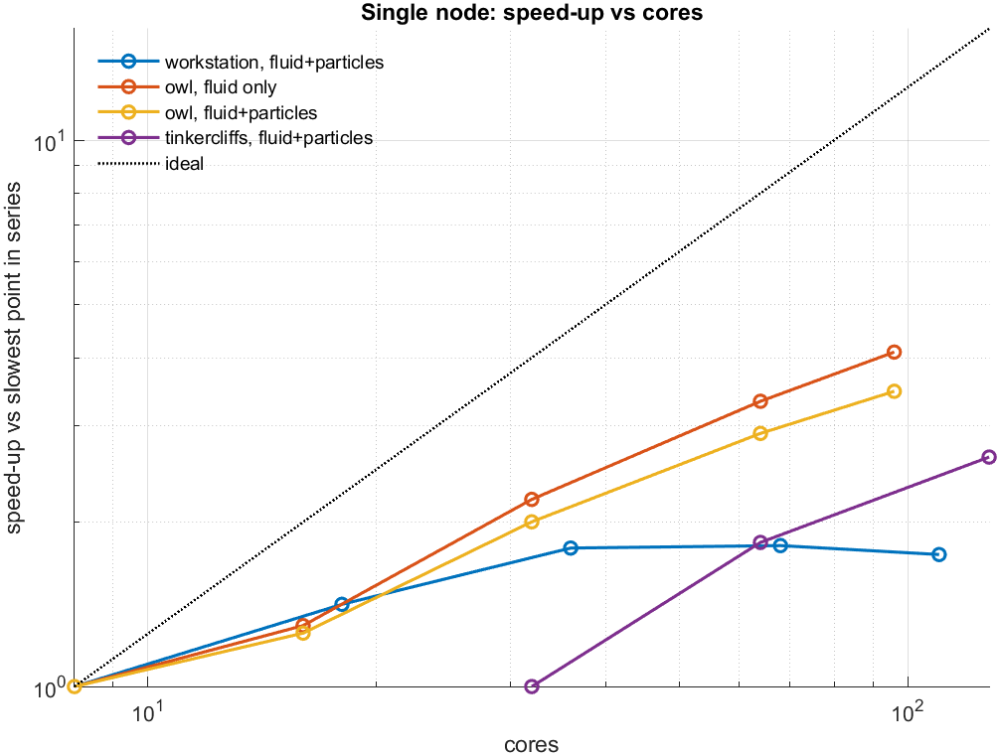
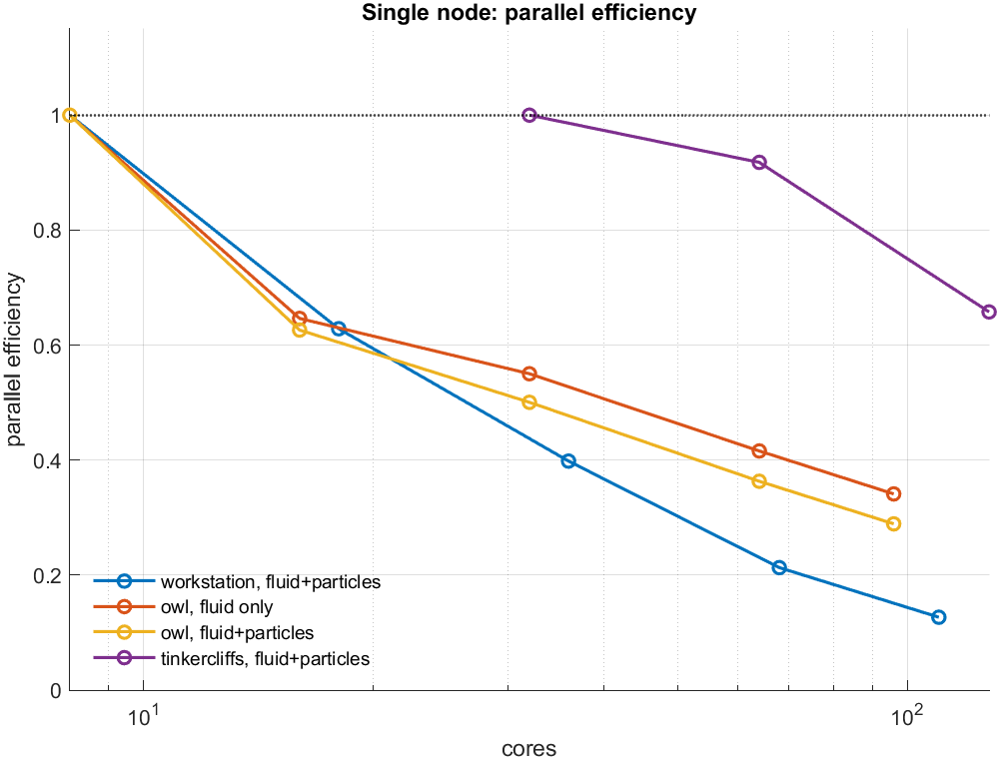
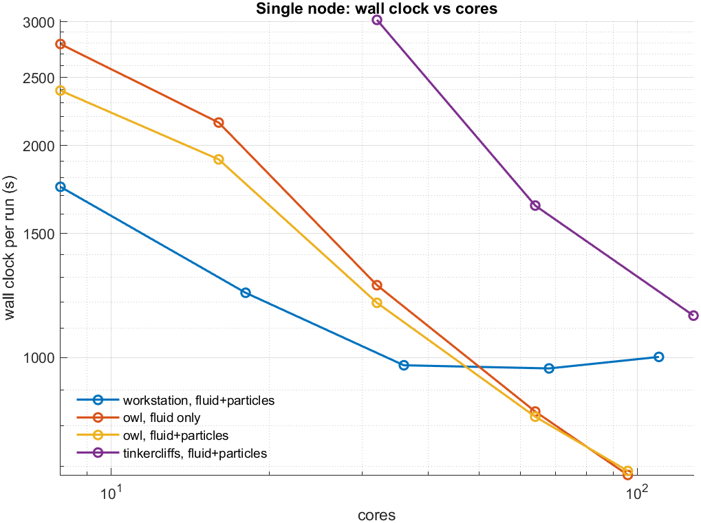
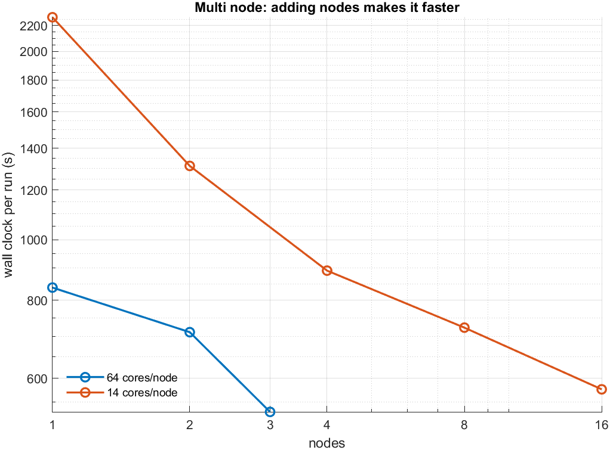

# Scaling ANSYS CFX across a cluster

A group of us could not run the simulations we needed. The cases were large (a three-stage axial compressor at roughly 27 million elements), and on the lab workstation a single run took about a
month. The instinct was to ask for a bigger machine.

This is the benchmark study I ran instead, and the two things it found that I did not expect.

Measured 2025–26 on Virginia Tech's ARC clusters. Independent work, not part of my dissertation.

---

## 1. More cores on one machine stops helping, then hurts



The workstation (blue) flattens around 1.8× and then turns **down**: 965 s at 68 cores,
**1002 s at 110**. Past that point every core added made the run slower.

| machine | 8 → 64 cores | efficiency at 64 |
|---|---|---|
| workstation | 1.8× | ~25% |
| Owl (cluster) | 3.7× | ~45% |

Both fall well short of ideal, which is normal. The difference is where they give up.



Even at its best, moving to the cluster and keeping to one node bought only **20–30%**, a month
becomes about three weeks. Worth having, not worth restructuring anything for.

## 2. Architecture matters more than core count



At matched core counts, Owl against Tinkercliffs on the same case:

| cores | Owl | Tinkercliffs | ratio |
|---|---|---|---|
| 32 | 1196 s | 3018 s | **2.52×** |
| 64 | 824 s | 1644 s | **2.00×** |

Owl runs Zen 4 (EPYC 9454), Tinkercliffs Zen 2 (EPYC 7702). A generation of CPU is worth more
here than doubling the cores, which is not the trade most people reach for first.

## 3. Adding nodes made it faster, which it is not supposed to



Standard advice for this solver is to **minimise** node count. Domain decomposition leaves the
partitions interdependent, every iteration exchanges boundary data between ranks, and across a
network that costs 10–100× what it costs inside a node. More nodes should mean a slower run.

| cores/node | 1 node | 2 | 3 | 4 | 8 | 16 |
|---|---|---|---|---|---|---|
| 64 | 838 s | 711 s | 530 s | | | |
| 14 | 2269 s | 1312 s | | 892 s | 723 s | **576 s** |

**3.9× going from one node to sixteen.** Shown these numbers, the university's research computing
director called the result "generally the opposite of what I would expect", and supplied the
explanation: the workload is not compute-bound. It is limited by storage I/O and memory
throughput. Spreading it across more machines multiplies the aggregate I/O capacity and puts the
work on more independent CPU–memory buses. The communication penalty is real; the bandwidth gain
is simply larger.

That reframes the original question. The answer was never one machine with more memory; it was
more machines, each with its own memory bus. A large-memory node would have been worse, since
those clock slower (2.45 GHz against 2.75 GHz on the normal queue).

## 4. What actually capped us was licences

Extrapolating the multi-node trend to 16 nodes × 64 cores puts the month-long case near
**8.75 days**. That ceiling is not hardware. It is the number of ANSYS licences the group can hold
at once, 400 at the time of the study.

Establishing that changed what we asked for: normal-queue nodes in quantity rather than one large
machine, and licence capacity treated as a first-class constraint. The allocation supporting the
group's sponsor-facing work was subsequently doubled.

---

## When the model broke the solver

A separate failure, from the same period. My particle-breakage model creates particles (a fragmenting parcel becomes several, those fragment again), so the tracked population grows
through the run. The flow solve stayed stable; the job died anyway, on dynamic memory exhaustion
inside CFX's own particle-track bookkeeping.

| | injected | grew to | track file | outcome |
|---|---|---|---|---|
| workstation | 1,000 | ~6,000 (6×) | 1.35 GB | completed |
| cluster, 6 nodes × 64 ranks | 500,000 | **~3.4 M** (6.8×) | **444 GB** | killed |

The multiplication factor is stable at 6–7×; what changes is the absolute scale. Two things came
out of chasing it:

**The pressure is per-rank, not per-node.** Breakage concentrates where impacts concentrate:
blade, hub, shroud, so a few ranks carry far more particles than the rest. The job dies when the
worst rank hits its own limit, which happens while total node memory still looks comfortable.

**The I/O cost was latency, not bandwidth.** Track files are written incrementally in many small
operations, and on a cluster `/scratch`, `/home` and `/projects` all live on remote storage. Many
small sequential operations are dominated by per-operation latency. Writing to the compute node's
own disk is the change that matters; moving between remote filesystems buys about 10%.

[`notes/dynamic-memory-and-io.md`](notes/dynamic-memory-and-io.md) has the full write-up: the
failure signature, the evidence, and the questions I took to the HPC centre.

---

## Method notes, and what to distrust

- **Each point is one run, not an average.** Enough to separate 2× effects; not enough to argue
  about 5%.
- **Use `--exclusive`.** Timings fluctuated until jobs stopped sharing nodes with other tenants.
  A scaling study built on unrepeatable timings measures nothing. Some of the earliest runs here
  predate that discovery.
- **Speed-up is referenced within each series**, to that series' own slowest point. Tinkercliffs
  starts at 32 cores rather than 8, so its curve is not directly comparable to the others in the
  speed-up plot, use the wall-clock plot for absolute comparisons.
- **8.75 days is an extrapolation**, not a measurement.
- Multi-node jobs failed with solver error 255 at certain rank counts. The workaround that worked
  was core counts that are not powers of two: 36 rather than 32, 68 rather than 64. I never
  established why.

## Reproducing the figures

```
data/single_node.csv     wall clock vs cores, per machine and workload
data/multi_node.csv      wall clock vs node count
scripts/make_figures.m   regenerates everything in figures/
slurm/                   job scripts, sanitised
```

Run `make_figures.m` from `scripts/`. MATLAB, no toolboxes. Every figure in this README is
generated from the CSVs: nothing is hand-drawn, so the numbers in the tables and the numbers in
the plots cannot drift apart.
